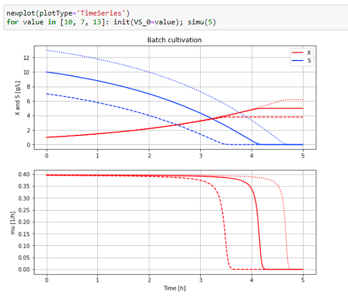

## Using Google Colab to run an application in Bioprocess Library

Google Colab is essentially a VM Ubuntu 18.04 machine that people with a google-account can get in the cloud. You configure it yourself and can have it for up to 12 hours and then it is closed. Next time you need to configure it again. It is pre-configured with Python 3.7 and some common libraries and you interact through a Colab notebook that is based on Jupyter notebook. More about it you can find here 
[Colab](https://colab.research.google.com/).

I have made a notebook that set-up PyFMI 2.7.4 and needed libraries and run a small example with microbial batch cultivation. The model is an example taken from Bioprocess Library and the example is available as an FMU. You can interact with it through a simplified command-line interface using: newplot(), par(), inut(), simuI() etc. More about the command-line interface you find here 
[FMU-explore](https://openmodelica.org/events/openmodelica-workshop/openmodelica-program-2022-a)
and is a layer on top of [PyFMI](https://github.com/modelon-community/PyFMI).

Below script and diagram with two simulations of batch growth with different initial substrate level that you will get at the end of the notebook.

You start up the notebook in Colab by pressing here
[start BPL notebook](https://colab.research.google.com/github/janpeter19/BPL_TEST2_Batch/blob/main/BPL_TEST2_Batch_with_pyfmi_274_py_3713.ipynb).
Then you in the menu choose Runtime/Run all.

The installation takes just a few minutes if you have good internet connection. The subsequent execution of the simulations of microbial growth take just a second or so. You can continue in the notebook and make new simulations and follow the examples given.

Note that:
* The script occassionaly get stuck during installation. Then just close the notebook and start from scratch.
* After a simulation there is warning for that the type float is depracated. The warning is due to the fact that we need to run in an older combination of Python and the key library PyFMI. This is corrected in later versions.
* Remember, you need to have a google-account!
